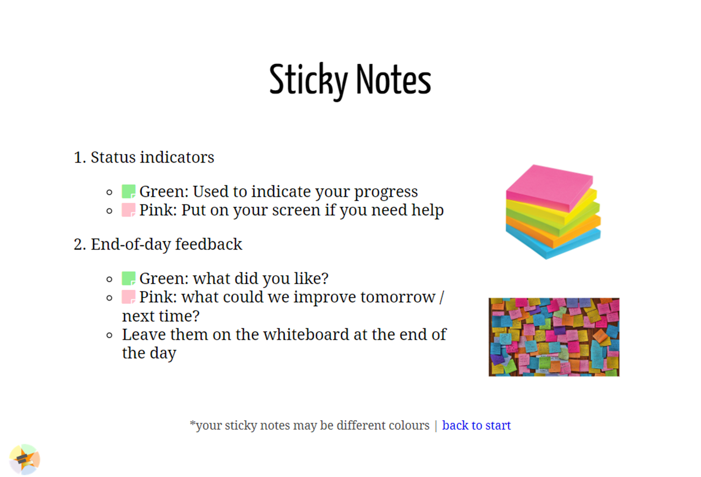
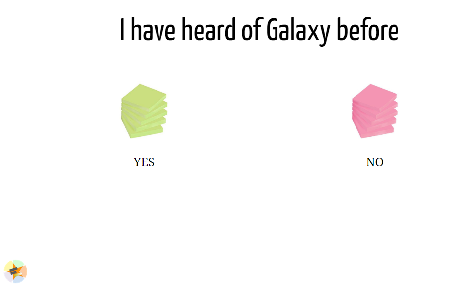
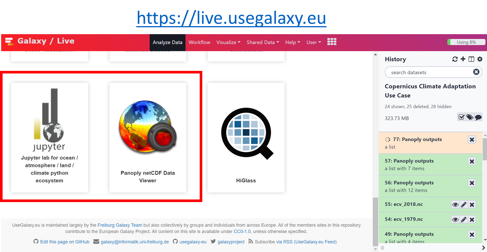
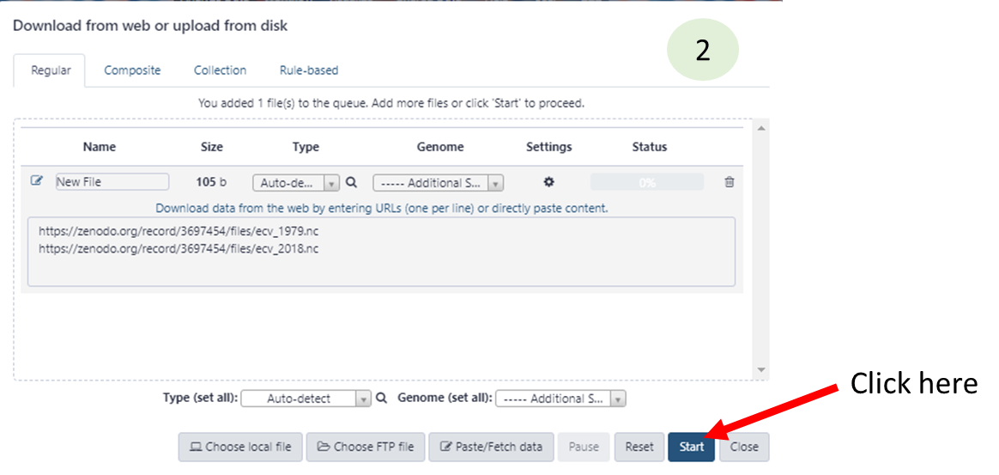
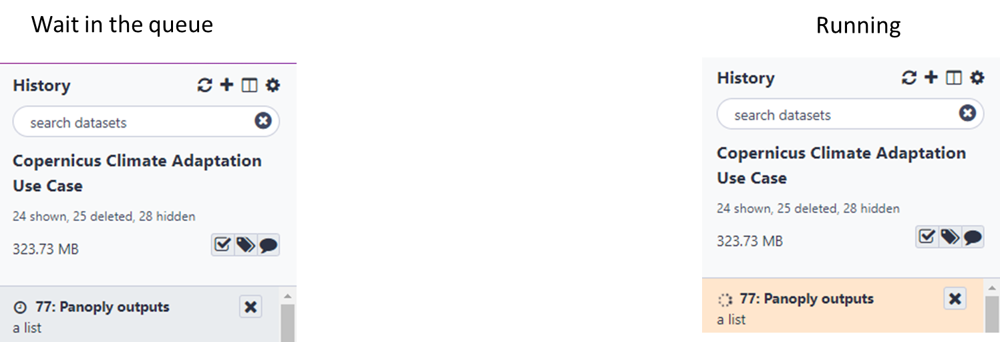
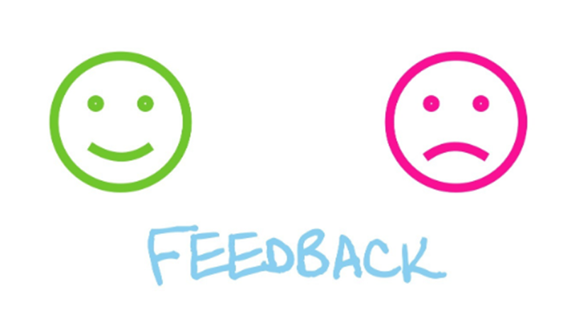

# [Norway/Sweden training](https://nordicesmhub.github.io/Norway_Sweden_training/)

# http://bit.ly/C3S-NO-SE

# Data extraction and easy visualization with galaxy climate science workbench

**Author**: Anne Fouilloux

## How do we use sticky notes?




## Have you heard about Galaxy?




## Have you ever used Galaxy?


## Galaxy Climate workbench

#### Galaxy Interactive environment for Climate data analysis and Visualization




## Set up for workshop

- [Register](https://climate.usegalaxy.eu/login) and log in to [https://climate.usegalaxy.eu](https://climate.usegalaxy.eu)
    - You may receive an e-mail with an activation link
- Go to the following URL:
    https://usegalaxy.eu/join-training/c3s to join the c3s training group
       -  Give us higher priority for running: *valid on 6th March 2020 only!*. Skip this step if you join on a different day.

## General introduction to Galaxy

- <a target="_blank" href="https://training.galaxyproject.org/training-material/topics/introduction/tutorials/galaxy-intro-101-everyone/tutorial.html">Galaxy 101 for everyone</a>

## Panoply in Galaxy

- <a target="_blank" href="https://training.galaxyproject.org/training-material/topics/climate/tutorials/panoply/tutorial.html">Visualize Climate data with Panoply netCDF viewer</a>

### Short version (for impatients who already know Panoply...)

- Go to <a target="_blank" href="https://climate.usegalaxy.eu/">https://climate.usegalaxy.eu/</a>
    1. Upload sample dataset
    2. Click on "**Paste/Fetch data**"


```
https://zenodo.org/record/3697454/files/ecv_1979.nc
https://zenodo.org/record/3697454/files/ecv_2018.nc
```



- Go to <a target="_blank" href="https://live.usegalaxy.eu/?tool_id=interactive_tool_panoply">Start Panoply in Galaxy</a>
- Select dataset *ecv_1979.nc* and press **Execute**
    - _If you do not see_ **ecv_1979.nc** _in yourhistory (right panel),_
       _make sure to first switch to the history that contains your dataset._


# Wait for Panoply to be ready
 


- Once running go to User --> Interactive Tools and click on *Panoply interactive tool* to launch it
- Then use Panoply as usual.


# Start Panoply in Galaxy

- To save your plots, make sure you store them in
    **output** folder
- Quit Panoply when you are done and go back to
    Analyze to get your outputs (click on **Panoply outputs** )
- You can view your plot on Galaxy using 
- You can download your plot on your laptop using 

# Pangeo JupyterLab in Galaxy

[pangeo](http://pangeo.io/) Jupyterlab with all the software stack (python packages) and [data](https://catalog.pangeo.io/) is available on Galaxy.

- Go to <a target="_blank" href="https://live.usegalaxy.eu/?tool_id=interactive_tool_climate_notebook">JupyterLabfor Ocean/Atmosphere/Land/Climate python ecosystem</a>
- Select dataset *ecv_1979.nc* and press **Execute**
- Go to User --> Interactive Tools and click on _Climate interactive tool_ to launch it
- Then you should get a jupyterLab session
- Open *ipython_galaxy_notebook.ipynb*
- To save your plots, data, etc. follow instructions given at the top ofthe default
    notebook( _get_ , _put_ )
**SAVE your work regurlarly in Galaxy using ** *put*; for instance, in a notebook code cell:

```
put("ipython_galaxy_notebook.ipynb")
```

where `ipython_galaxy_notebook.ipynb` is the name of your notebook.

In a similar way, do not forget to save data you cannot easily reproduce:

```
put("data.nc")
```

where `data.nc` is a netCDF file you would line to save in Galaxy.

- QuitJupyterLab when you are done and go back to **[Analyze](https://live.usegalaxy.eu/)** to get your outputs
    (those you added with _put_ )
- You can view your plot on Galaxy using 
- You can download your plot on your laptop using 

A more comprehensive tutorial can be found [here](https://training.galaxyproject.org/training-material/topics/galaxy-ui/tutorials/jupyterlab/tutorial.html)

# Learn more about Galaxy

- [Galaxy 101 for everyone](https://training.galaxyproject.org/training-material/topics/introduction/tutorials/galaxy-intro-101-everyone/tutorial.html)
- [Visualize Climate data with Panoply netCDF viewer](https://training.galaxyproject.org/training-material/topics/climate/tutorials/panoply/tutorial.html)
- [JupyterLab in Galaxy](https://training.galaxyproject.org/training-material/topics/galaxy-ui/tutorials/jupyterlab/tutorial.html) (**please make sure to use the a target="_blank" href="https://live.usegalaxy.eu/?tool_id=interactive_tool_climate_notebook">JupyterLabfor Ocean/Atmosphere/Land/Climate python ecosystem</a> rather than the default jupyterLab environment (that does not contain any climate related packages).
- Import shared histories (click on the link)
    - <a target="_blank" href="https://climate.usegalaxy.eu/u/annefou/h/copernicus-climate-training-panoply">Copernicus Climate Training: Panoply</a>
    - <a target="_blank" href="https://climate.usegalaxy.eu/u/annefou/h/copernicus-climate-training-how-to-use-climate-data-for-olive-farming-in-andalusia">Copernicus Climate Training: How to use climate data for Olive farming in Andalusia</a>
    - <a target="_blank" href="https://climate.usegalaxy.eu/u/annefou/h/copernicus-climate-training">Copernicus Climate Training: the ALPS -a dying ski tourism destination?</a>

# Feedback




